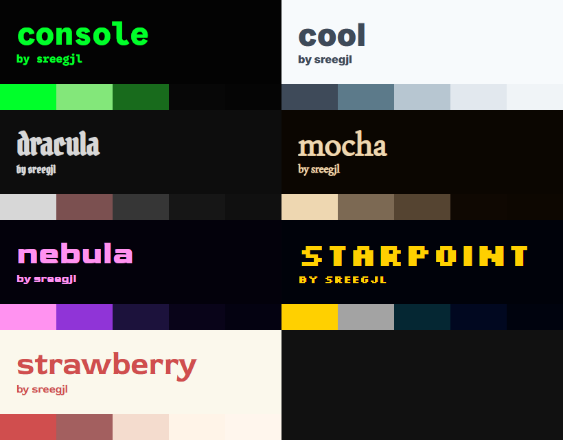

## Adding a theme

Submit your theme `.json` file by either:

- Dropping it into the `inbox/` folder and running `node scripts/import.js`, or
- Emailing it to [sreegjl@gmail.com](mailto:sreegjl@gmail.com)

See the [theme documentation](https://github.com/sreegjl/timelines/wiki/Themes) for the full JSON format.

## Regenerating thumbnails

To regenerate thumbnails for all existing themes and update `docs/preview.png`:

```
node scripts/generate_thumbnails.js
```

To regenerate a single theme:

```
node scripts/generate_thumbnails.js --theme <id>
```
